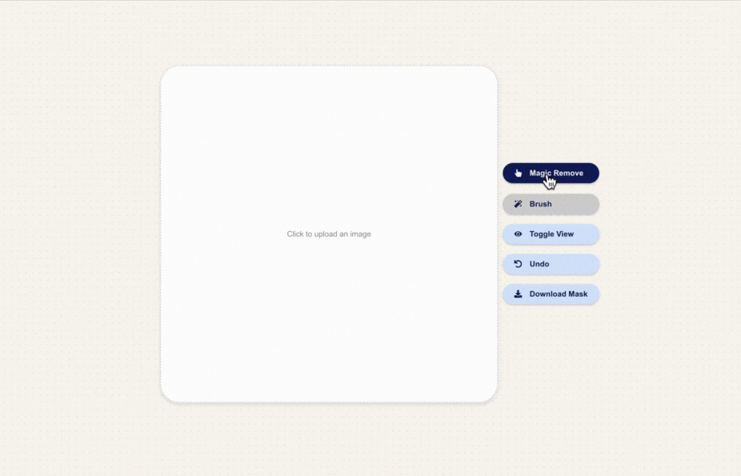
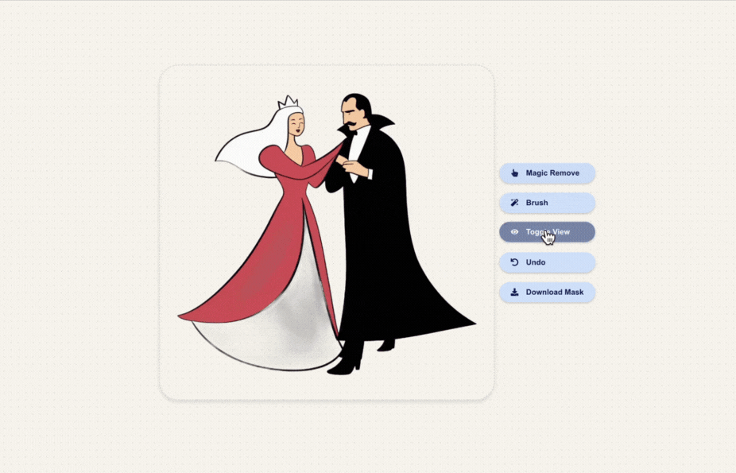
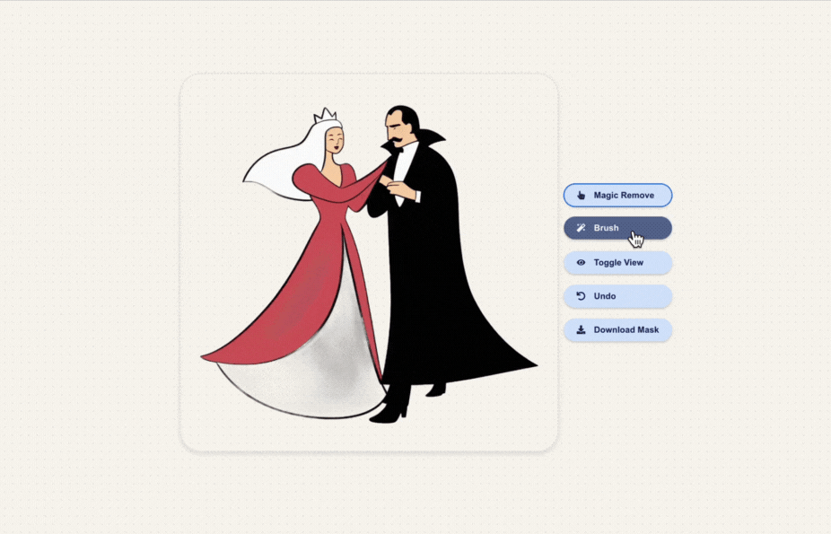
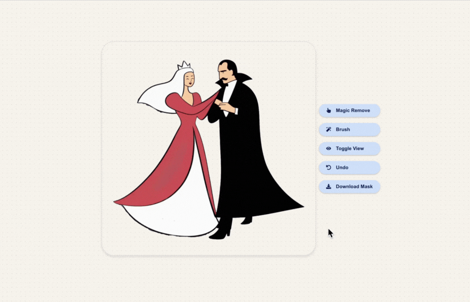

# Background Removal

## Project Description
This project is a background removal demo developed as part of a consulting project with Blunge.AI under 180 Degrees Consulting. It aims to explore and demonstrate various tools for background removal, providing insights into how different models perform on this task. The project is accompanied by a research report that details the models used, their architectures, and the results.

## How to Run the Application
To run the front-end for this project, follow these steps:

1. Navigate to the `blunge-ai-frontend` directory.
2. Install dependencies (if not already installed) by running:
   ```bash
   npm install
3. Start the project by running the back_end.py file 
4. Next in a new terminal run:
   ```bash
   npm start
5. It will ask if you would like to run in an alternative port. Click yes.
6. Navigate to 'http://localhost:3001' to use the application

## Research Report
A comprehensive research report accompanies this project, outlining the background removal models used and their results. You can view the report [here](https://docs.google.com/document/d/1MyD-i57LvN-rH2dc7LvEKHIrMT19zSuWtWPWVm8hRHo/edit?tab=t.0).

### Table of Contents from the Research Report:
#### Business Component:
- Customer interview and market research
- Market Sentiment Analysis 
#### Technical Component:
##### Segmentation Model Experimentation:
The following models were tested using a wide range of parameter

- [Bira.ai](https://bira.ai/)
- [SAM by Meta](https://segment-anything.com/)
- [rembg](https://github.com/danielgatis/rembg)
- [SegNet](https://arxiv.org/abs/1511.00561)

The report includes image outputs for all these models along with their architectures, showcasing their performance on background removal tasks.
##### Front-End Functionality And Design Thesis:
- Highlights the justification behind design decisions

## Functionality 

This demo allows users to upload their own images or use Stable Diffusion-generated images from Blunge.AI. By leveraging the Bira.AI model from Hugging Face, users can remove the background of their images with minimal distortion, resulting in a clean and seamless image segmentation process. 

If the background is not removed users are not able to use the brush tool.



After the background is removed, users are able to toggle between viewing the original photo and the processed image with the background removed.



Additionally, users are able to amend any defects in the background removal using an erase and recover brush, with adjustable brush sizes to ensure precise edits. 



Finally, users can directly download the segmented image as a PNG file.




## Tech Stack Used
### Front-End
- **React:** A JavaScript library for building user interfaces.
- **TypeScript:** A statically typed version of JavaScript used for better code quality and debugging.
- **CSS:** For styling the user interface and layout.
- **React Hooks:** State and lifecycle management for functional components.
- **HTML5 Canvas:** Used for drawing and manipulating images, including brush and erase tools.
### Back-End
- **Python:** Used for the server-side code.
- **Flask:** A lightweight web framework for handling API requests.
- **Transformers (HuggingFace):** Used for the image segmentation pipeline (image-segmentation model).
- **Pillow (PIL):** For image manipulation in Python.
- **Flask-CORS:** For enabling Cross-Origin Resource Sharing, allowing the front-end to communicate with the back-end.
### Other Tools
- **npm:** Used for managing dependencies and running the front-end application.
- **Fetch API:** For handling HTTP requests between the front-end and back-end.
- **Browser's Blob:** To handle image downloads in the front-end


## Extension 
An extension to this report could involve implementing an inpainting model to generate a custom background for the segmented images (outpainting).
A link to a hugging face repository can be found [here](https://huggingface.co/docs/diffusers/advanced_inference/outpaint#image-preparation)


   
